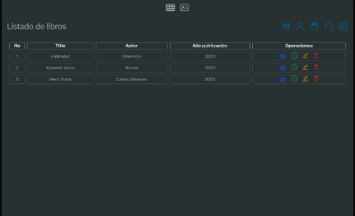

  

¡Hola, soy Carlos! 👋

Soy un estudiante apasionado de la programación y actualmente me encuentro aprendiendo y trabajando con el stack MERN (MongoDB, Express.js, React.js y Node.js).

## Habilidades

#### Front-End

- 
- 
- 
- 
- 

#### Back-End

- 
- 
- 

#### Bases de Datos

- 
- 
- 

#### Testing

- 

#### Control de Versiones

- 
- 

#### Gestión de Paquetes

- 

## Proyectos

### BookStore

BookStore es un proyecto que desarrollé para gestionar libros (CRUD) utilizando el stack MERN.

- **Frontend**: [Repositorio](https://github.com/carlosYoko/book-store-frontend)
- **Backend**: [Repositorio](https://github.com/carlosYoko/book-store-backend)

Puedes ver la aplicación en vivo [aquí](https://book-store-frontend-tan.vercel.app/).

## Contacto

Puedes encontrarme en:

- 
- 
